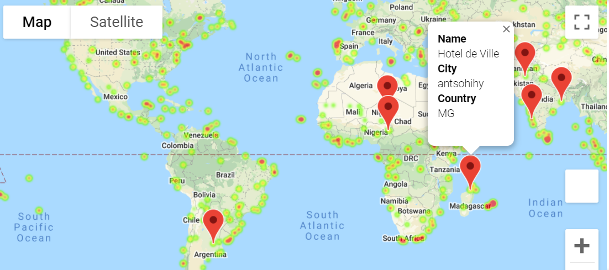

Using Pandas, Jupyter Notebook, OpenWeather API, and Google Places API, visualized various weather data for multiple locations nearing the equator. After making scatter plots and creating linear regressions, created heatmaps for ideal vacation destinations based on the previous weather analysis and location data. 

